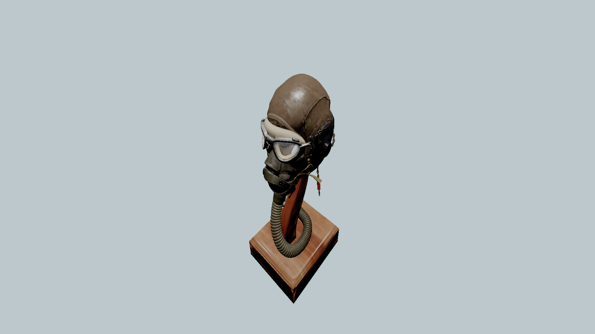
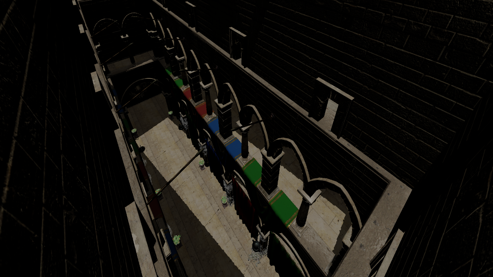
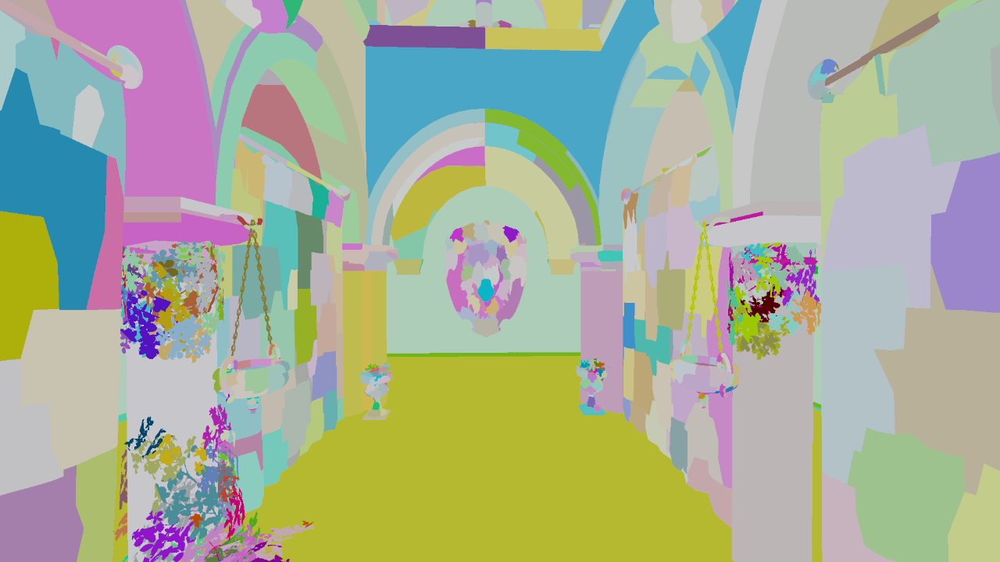

# vulkan-renderer
A vulkan renderer for viewing 3d models <br />
 <br />
 <br />
 <br />

## Features
- Model loading (.gltf) <br />
- Physically Based Rendering <br />
- Deferred Shading <br />
- Mesh shader pipeline <br />
- Two pass occlusion culling <br />
- Frame graph for automatic synchronization between passes <br />
- GPU Profiler <br />
- Directional Shadows <br />
- Asynchronous texture loading <br />

## How to run the application on windows 
### Requirements
- Visual Studio 2022 <br />
- CMake >= 3.13 <br />
- Vulkan SDK 1.3.x <br />
## Build
To generate cmake files: <br />
```
mkdir build
cd build
cmake ..
```
To build the executable: <br />
`cmake --build .` <br />
or <br />
`cmake --build . --config Release` <br />
